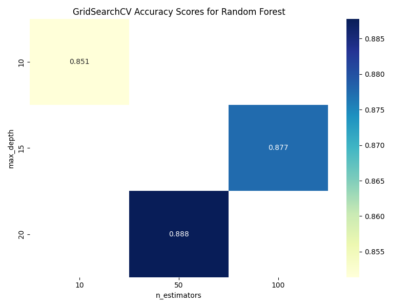
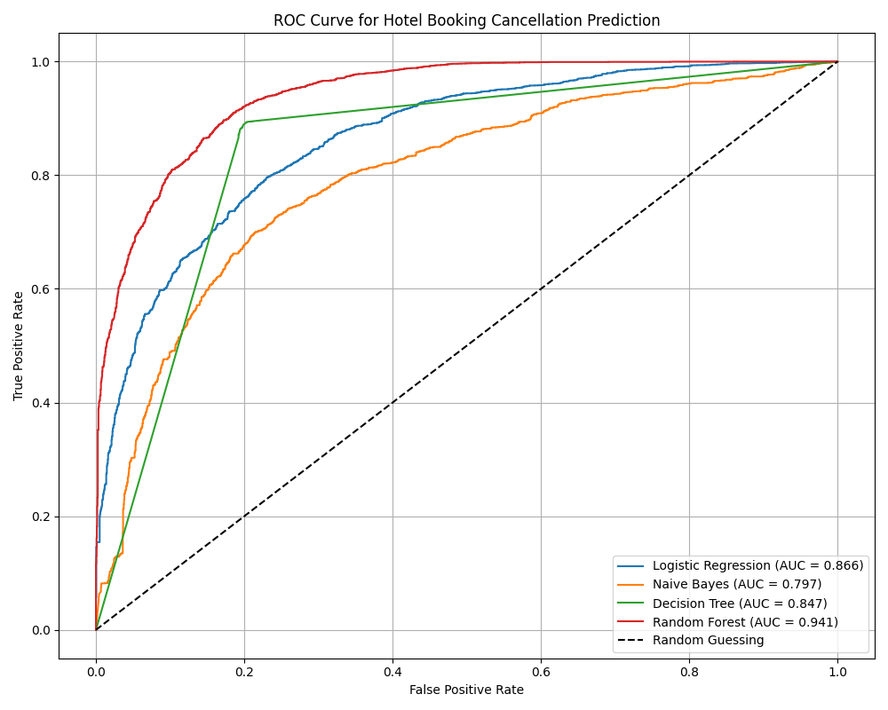

# 🏨 Hotel Reservation Cancellation Prediction
This project predicts hotel booking cancellations using multiple machine learning models with evaluation and hyperparameter tuning on a real-world dataset

## 📊 Dataset
Dataset:[Hotel Reservations Classification]([https://archive.ics.uci.edu/dataset/563/iranian+churn+dataset](https://www.kaggle.com/datasets/ahsan81/hotel-reservations-classification-dataset)) 

- Rows: 36,275
- Target Variable: booking_status (Canceled or Not)

## 🚀 Workflow

- Loaded and cleaned dataset (removed irrelevant columns)
- Visualized key features (booking_status, lead_time, avg_price_per_room)
- Encoded categorical features with one-hot encoding
- Standardized numerical features (lead_time, avg_price_per_room)
- Defined features (X) and target (y)
- Performed cross-validation with KFold and StratifiedKFold
- Trained and evaluated models: Logistic Regression, Naive Bayes, Decision Tree, Random Forest
- Hyperparameter tuning with GridSearchCV and RandomizedSearchCV (Random Forest)
- Plotted GridSearchCV heatmap of accuracy scores
- Evaluated ROC-AUC curves for all models

## 🧪 Model Evaluation Results

| Model               | Stratified CV Accuracy | ROC-AUC |
|---------------------|-----------------------:|--------:|
| Logistic Regression | 80.1%                  | 0.866   |
| Naive Bayes         | 40.8%                  | 0.797   |
| Decision Tree       | 85.6%                  | 0.847   |
| Random Forest       | 87.7%                  | 0.941   |

## 📈 Hyperparameter Tuning: GridSearchCV Results for Random Forest

## GridSearch Heatmap

Heatmap shows mean accuracy scores for combinations of max_depth and n_estimators.

## ROC Curve

ROC curves for Logistic Regression, Naive Bayes, Decision Tree, and Random Forest models, showing Random Forest performs best with an AUC of 0.941.

## ⚙️ Installation

1. Clone the repo:

```bash
git clone https://github.com/yourusername/hotel_reservation_cancellation.git
cd hotel_reservation_cancellation
```
2. **Install dependencies:**:   
```commandline
pip install -r requirements.txt
```

📂 Files in This Repo

- hotel_cancellation.ipynb: Jupyter notebook with data cleaning, EDA, modeling, hyperparameter tuning, and visualization
- gridsearch_results.png: Heatmap of GridSearchCV results for Random Forest
- roc_auc.png: ROC curves for all models
- requirements.txt: Python dependencies

👨‍💻 Author

Yoseph Negash

📧 yosephn22@gmail.com

📅 2025


